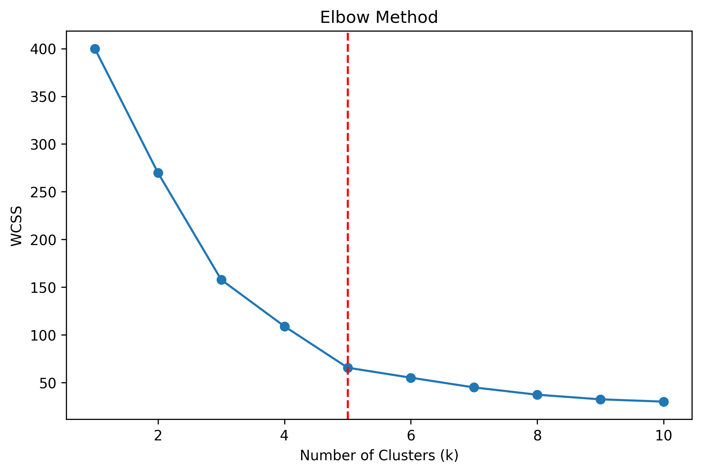
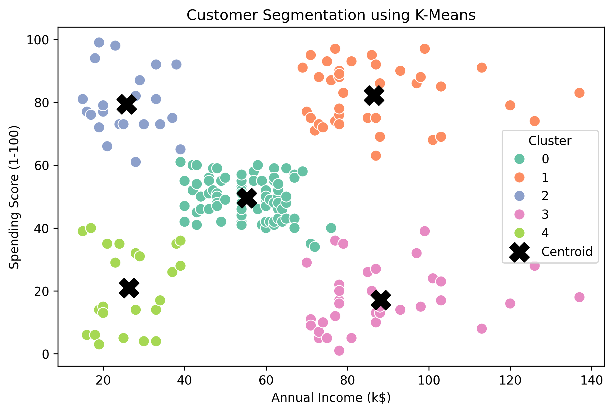
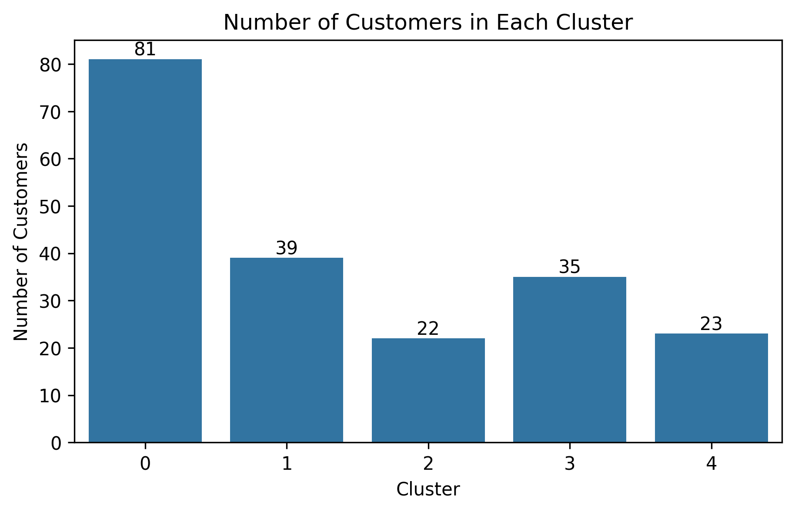
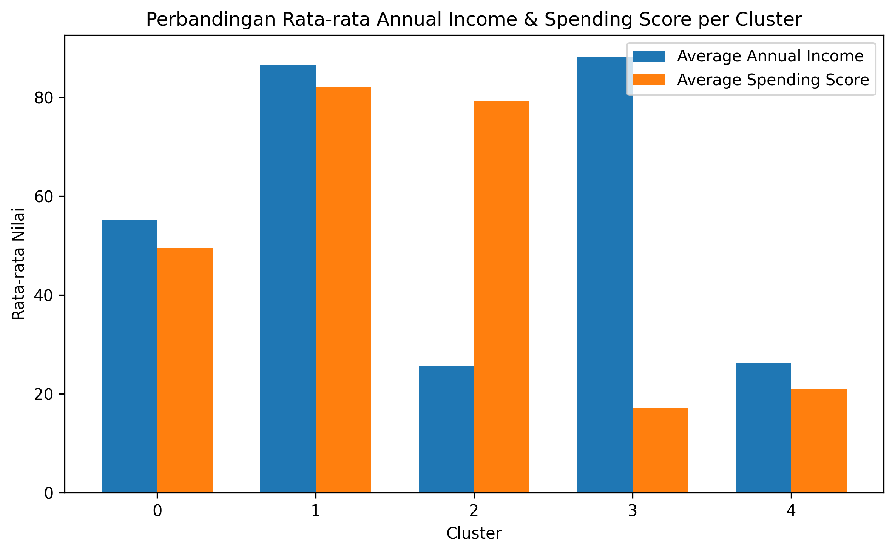
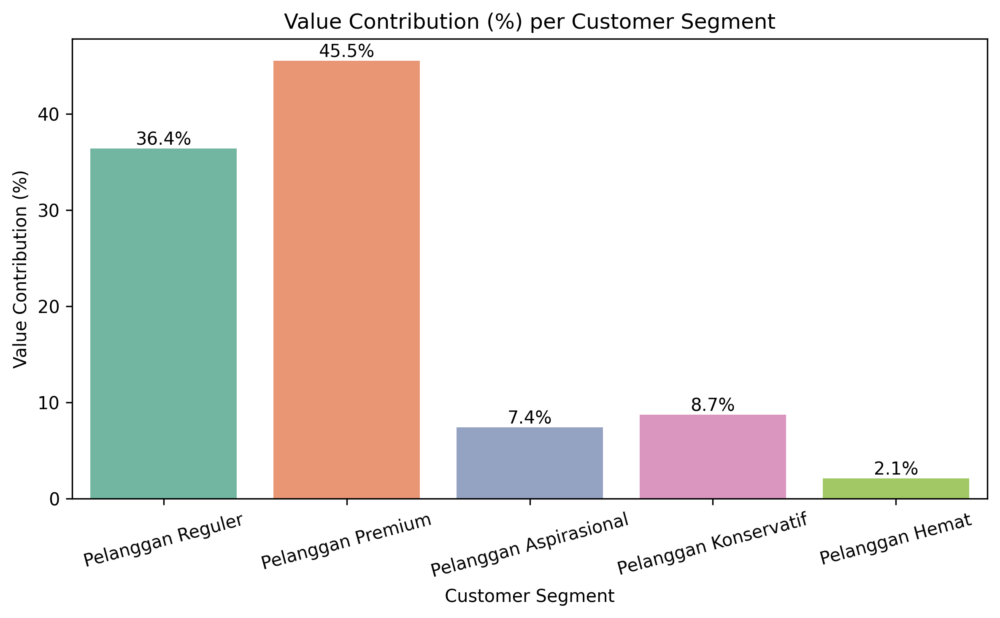

# Customer Segmentation Analysis using K-Means Clustering


## Project Overview

Project ini mengelompokkan pelanggan mall ke dalam lima segmen menggunakan K-Means Clustering, kemudian menerjemahkan setiap segmen menjadi rekomendasi strategi pemasaran yang dapat langsung ditindaklanjuti.

## Business Problem

Perusahaan belum memiliki segmentasi pelanggan yang jelas sehingga promosi masih dilakukan secara umum kepada seluruh pelanggan. Akibatnya, strategi pemasaran kurang efektif karena belum mempertimbangkan karakteristik setiap kelompok pelanggan.

## Objectives

- Mengelompokkan pelanggan berdasarkan kemiripan karakteristik menggunakan K-Means Clustering
- Memprofilkan setiap segmen agar memiliki makna bisnis yang jelas, bukan sekadar label numerik
- Menyusun rekomendasi strategi pemasaran yang relevan untuk masing-masing segmen

## Project Results

| Metrik | Hasil |
|--------|--------|
| Jumlah Segmentasi Pelanggan | 5 |
| Jumlah Klaster Optimal | K = 5 |
| Silhouette Score | 0.555 |
| Davies-Bouldin Index | 0.572 |
| Business Output | MRekomendasi pemasaran untuk lima segmen pelanggan |


## Visual Summary

### Elbow Method



Jumlah cluster optimal (K=5) ditentukan menggunakan Elbow Method, didukung oleh Silhouette Score 0.555 dan Davies-Bouldin Index 0.572.

---

### Customer Segmentation



Lima cluster terbentuk dengan pemisahan yang cukup jelas berdasarkan Annual Income dan Spending Score.

---

### Cluster Distribution



Distribusi pelanggan menunjukkan bahwa **Pelanggan Reguler** merupakan segmen terbesar (40.5%), sedangkan **Pelanggan Premium** hanya mencakup 19.5% dari total pelanggan. Hal ini menunjukkan bahwa ukuran segmen tidak selalu sebanding dengan kontribusi nilai bisnis.

---

### Cluster Profiling



| Segmen | Karakteristik | Jumlah Pelanggan | Kontribusi Nilai |
|---|---|---|---|
| Pelanggan Premium | Income tinggi, Spending Score tinggi | 39 (19.5%) | 45.5% |
| Pelanggan Reguler | Income & Spending Score menengah | 81 (40.5%) | 36.4% |
| Pelanggan Konservatif | Income tinggi, Spending Score rendah | 35 (17.5%) | 8.7% |
| Pelanggan Aspirasional | Income rendah, Spending Score tinggi, usia relatif muda | 22 (11%) | 7.4% |
| Pelanggan Hemat | Income rendah, Spending Score rendah | 23 (11.5%) | 2.1% |

---

### Value Contribution per Segment



Meski hanya 19.5% dari total pelanggan, **Pelanggan Premium menyumbang 45.5% estimasi kontribusi nilai belanja** yang artinya melebihi Pelanggan Reguler yang jumlahnya lebih dari dua kali lipat. Bersama-sama, kedua segmen ini merepresentasikan 60% pelanggan namun menyumbang lebih dari 80% kontribusi nilai, menjadikannya prioritas utama alokasi sumber daya pemasaran.

## Key Insights

- Elbow Method menunjukkan jumlah cluster optimal sebanyak lima, didukung oleh Silhouette Score (0.555) dan Davies–Bouldin Index (0.572) yang menunjukkan kualitas clustering yang cukup baik.
- Kelompok pelanggan dengan pendapatan tinggi belum tentu memiliki tingkat pengeluaran tinggi, sehingga strategi pemasaran tidak dapat hanya didasarkan pada tingkat pendapatan.
- Pelanggan Konsevatif memiliki pendapatan tinggi kedua di antara seluruh segmen, namun kontribusi nilainya hanya 8.7% — menjadikan segmen ini *untapped potential* terbesar untuk pertumbuhan nilai pelanggan.

## Business Impact

- Mengidentifikasi lima segmen pelanggan dengan karakteristik dan potensi bisnis yang berbeda.
- Membantu perusahaan memfokuskan strategi pemasaran pada Premium dan Regular Customers yang memberikan kontribusi nilai terbesar.
- Mengungkap Pelanggan Konservatif sebagai segmen dengan potensi pertumbuhan tinggi meskipun aktivitas belanjanya masih rendah.
- Menyediakan dasar pengambilan keputusan berbasis data untuk strategi akuisisi, retensi, dan pengembangan pelanggan.

## Business Recommendations

| Prioritas | Segmen | Tujuan Bisnis | Rekomendasi Utama |
|---|---|---|---|
| Tinggi | Pelanggan Premium | Mempertahankan loyalitas pelanggan bernilai tertinggi | Program membership eksklusif, layanan personal, early access produk baru |
| Tinggi | Pelanggan Reguler | Meningkatkan frekuensi & nilai transaksi | Program loyalitas berjenjang, bundling produk, promosi personal |
| Sedang | Pelanggan Konservatif | Mengonversi daya beli tinggi menjadi aktivitas belanja | *Personalized offer*, komunikasi 1-on-1 (*relationship marketing*) |
| Sedang | Pelanggan Aspirasional | Mempertahankan keterlibatan & mendorong pertumbuhan daya beli | Promo berkala, skema cicilan/produk terjangkau, program poin |
| Rendah | Pelanggan Hemat | Mempertahankan pelanggan dengan efisiensi biaya pemasaran | Produk ekonomis, promosi massal (bukan personal) |

## Project Workflow

```
Business Understanding
        |
        ↓
Data Preparation
        |
        ↓
Exploratory Data Analysis (EDA)
        |
        ↓
Feature Selection & Scaling
        |
        ↓
Elbow Method
        |
        ↓
K-Means Clustering
        |
        ↓
Cluster Evaluation
        |
        ↓
Customer Segment Profiling
        |
        ↓
Business Insights
        |
        ↓
Business Recommendations
```

## Dataset Information

- **Nama:** Mall Customer Dataset
- **Sumber:** Kaggle
- **Jumlah data:** 200 pelanggan, 5 kolom
- **Fitur:** CustomerID, Gender, Age, Annual Income (k$), Spending Score (1–100)
- **Kualitas Data:** Tidak ada nilai yang hilang atau duplikat

## Tools & Technologies

| Kategori | Tools |
|---|---|
| Bahasa | Python |
| Pengolahan Data | Pandas, NumPy |
| Visualisasi | Matplotlib, Seaborn |
| Machine Learning | Scikit-Learn (K-Means, StandardScaler, Silhouette Score, Davies-Bouldin Index) |

## Repository Structure

```
├── data/
│   └── Mall_Customers.csv
├── notebooks/
│   └── Customer_Segmentation.ipynb
├── images/
│   ├── elbow_method.png
│   ├── cluster_distribution.png
│   ├── cluster_scatter.png
│   ├── cluster_profiling.png
│   └── value_contribution.png
├── README.md
└── requirements.txt
```

## How to Run

1. Clone repository ini
   ```
   git clone https://github.com/yourusername/customer-segmentation-kmeans.git
   ```
2. Install dependencies
   ```
   pip install -r requirements.txt
   ```
3. Buka notebook
   ```
   jupyter notebook notebooks/Customer_Segmentation.ipynb
   ```
4. Jalankan seluruh cell secara berurutan untuk mereproduksi hasil analisis

## Future Improvements

- Menambahkan variabel perilaku transaksi riil (frekuensi pembelian, recency, kategori produk dengan pendekatan RFM) untuk memperkaya profil segmen di luar data demografis
- Membandingkan performa K-Means dengan algoritma clustering lain (Hierarchical, DBSCAN, Gaussian Mixture Model) untuk menguji kestabilan segmentasi
- Melakukan validasi periodik (misalnya re-run clustering tiap kuartal) agar segmen tetap relevan seiring perubahan perilaku pelanggan
- Mengembangkan dashboard interaktif untuk memantau perubahan customer segment secara berkelanjutan.

## Author

**Evanda Nur Haliza**

Mathematics Graduate | Aspiring Data Analyst

Tertarik pada penerapan data science untuk mendukung pengambilan keputusan bisnis, khususnya di area customer analytics dan segmentation.

- LinkedIn: https://www.linkedin.com/in/evanda-nur-haliza/
- Email: evandanurhaliza072@gmail.com
